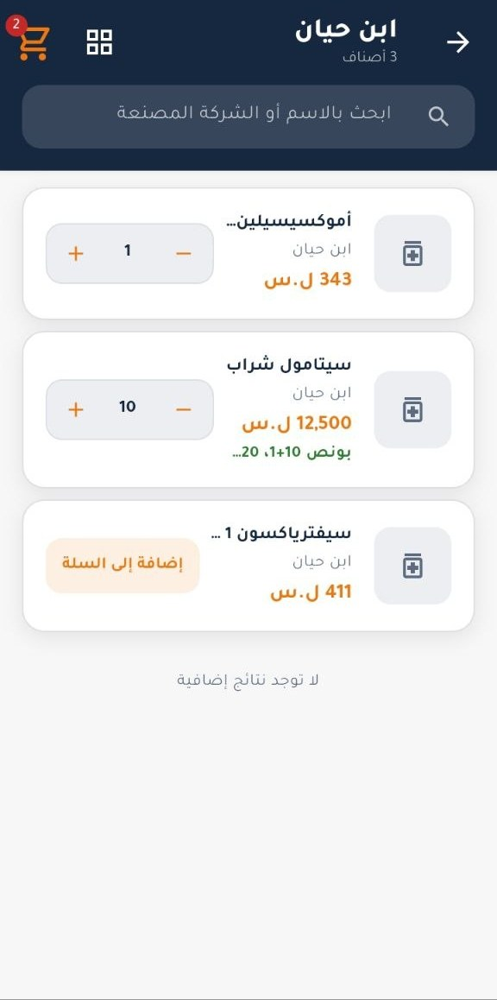
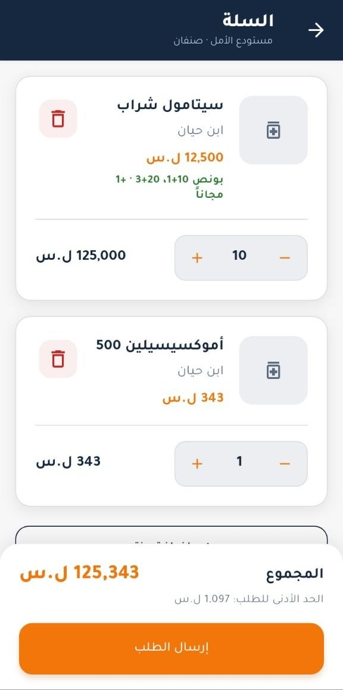
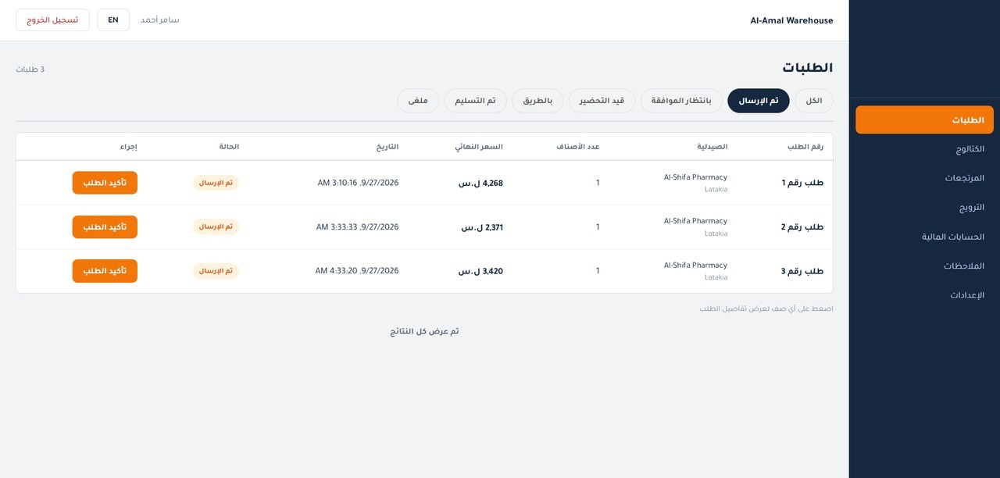
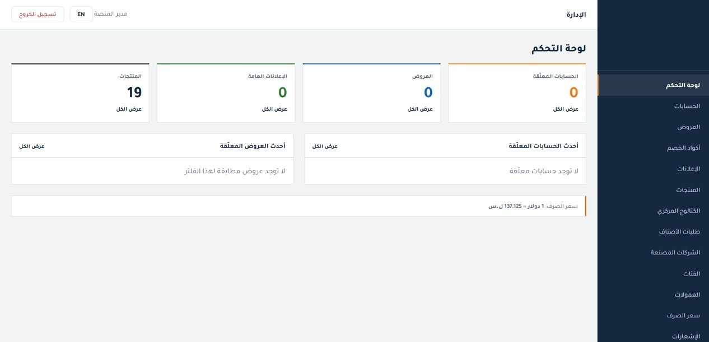
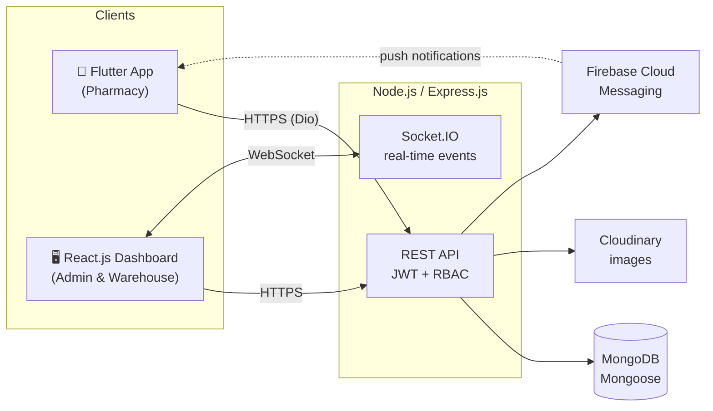

<h1 align="center">B2B Pharmacy Supply Platform</h1>

  A B2B pharmacy supply and order management platform that connects pharmacies with pharmaceutical warehouses. 
  Flutter mobile app · React.js Admin &amp; Warehouse Dashboard · Node.js / Express.js / MongoDB backend

  
  
  
  
  
  
  
  
  

> **Note:** This is a client project, so the source code is private and the product name and branding are not shown. This repository presents the architecture and my role in building it.

---

## 📱 Screenshots

### Pharmacy Mobile App (Flutter)

  
  &nbsp;
  

Warehouse catalog with search · Cart with bonus offers and minimum order value

### Warehouse Dashboard (React.js)

  

Order management with status workflow (sent → awaiting approval → preparing → on the way → delivered)

### Admin Dashboard (React.js)

  

Admin overview with products, offers, pending accounts, and the current exchange rate

---

## 🧩 The Problem

Pharmacies order medicines from several pharmaceutical warehouses, each with its own catalog, prices, offers, and credit terms. This platform puts this whole workflow on one platform: pharmacies browse and order from warehouses in a mobile app, while warehouses and administrators manage catalogs, orders, returns, and accounts from a web dashboard.

## 👥 Roles

| Role | Platform | What they do |
|---|---|---|
| **Pharmacy** | Flutter mobile app | Browse the catalog, pick a warehouse, place and track orders, request returns, follow debts and account history |
| **Warehouse** | React.js dashboard | Manage products, pricing, offers and discounts, process orders and returns, track payments, pharmacy debts, and settlements |
| **Admin** | React.js dashboard | Manage the master catalog, categories, manufacturers, accounts, exchange rates, commissions, banners, advertisements, and complaints |

Access is enforced with **JWT authentication and role-based access control** for the three roles.

---

## ✨ Features

### Pharmacy Mobile App (Flutter)
- Product catalog with search, categories, offers, and promotions
- Warehouse selection, cart, and quick reorder
- Order placement, order tracking, and order history
- Returns, reviews, and complaints
- Pharmacy debts and account history
- Push notifications with **Firebase Cloud Messaging**
- Arabic and English localization
- Secure token storage and automatic API session handling

### Admin & Warehouse Dashboard (React.js)
- Real-time order updates with **Socket.IO**
- Product management, including Excel catalog import with column mapping
- Orders, returns, reviews, and complaints workflows
- Offers, discounts, and discount codes
- Payments, pharmacy debts, and settlements
- Exchange-rate management for pricing
- Banners and advertisements
- Arabic and English interface

### Backend (Node.js / Express.js)
- RESTful API with a layered architecture: routes → controllers → services → models
- MongoDB with Mongoose
- JWT access and refresh tokens, OTP verification, and role-based access control
- Real-time events with Socket.IO and push notifications through Firebase Admin (FCM)
- Image uploads to Cloudinary
- Financial ledger and audit logging for payments and debts
- Security middleware: Helmet, rate limiting, and MongoDB query sanitization
- Database migration and seeding scripts

---

## 🏗️ Architecture

**Mobile app:** feature-first structure (data / presentation per feature), **Cubit (flutter_bloc)** for state management, **Dio** for networking, and **go_router** for navigation.

---

## 🧪 Quality

- **Flutter:** unit and widget tests for features such as catalog, cart, auth, and notifications (`bloc_test`, `mocktail`)
- **Backend:** automated tests with the Node.js test runner
- **Dashboard:** component and logic tests with Vitest
- **Load & stress testing:** k6 and Socket.IO load scenarios covering HTTP APIs, real-time connections, notifications, and uploads. The test campaign recorded zero server errors (5xx) and zero timeouts at every passing load level.

---

## 🛠️ Tech Stack

| Layer | Technologies |
|---|---|
| Mobile | Flutter, Dart, Cubit (flutter_bloc), Dio, go_router, Firebase Messaging |
| Web | React.js, Vite, React Router, i18next, Socket.IO Client |
| Backend | Node.js, Express.js, Socket.IO, JWT, Firebase Admin, Cloudinary |
| Database | MongoDB, Mongoose |
| Testing | flutter_test, bloc_test, mocktail, Node.js test runner, Vitest, k6 |
| Tools | Git, GitHub, Postman |

---

## 👨‍💻 My Role

**Full Stack & Flutter Developer**
- Built the Flutter mobile application for pharmacies
- Developed the web-based Admin & Warehouse Dashboard using React.js
- Built the RESTful backend services with Node.js, Express.js, MongoDB, and Mongoose
- Implemented authentication, role-based access control, real-time notifications, and the order, return, payment, and debt workflows

---

  <b>Yazan Aljundy</b> · <a href="mailto:yazanaljundy21@gmail.com">yazanaljundy21@gmail.com</a> · <a href="https://github.com/YazanAljundy">GitHub</a>

